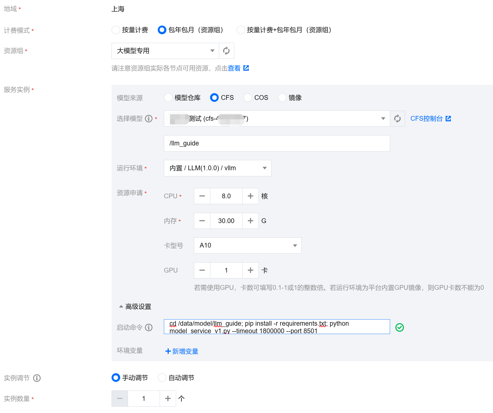

# llm_guide
本文介绍如何基于平台基础镜像，进行在TIONE平台上进行服务部署。

## 平台基础镜像
- 使用`docker pull ccr.ccs.tencentyun.com/tione-public-images/llm-infer:vllm-0.1.4-angel-deepspeed-ti-1.0.4-lic`拉取镜像到本地
- CUDA Version: 12.1
- Python包：参考附录章节 平台基础镜像中安装的python包

## 服务限制
- 服务必须以 HTTP 协议接受请求，并且只支持 POST 方法。
- 推理服务必须至少有一个端口监听在8501。
- 推理服务如果有多个监听端口，不能使用8502-8510这个范围内的端口。
- 上传的模型和代码会放置于/data/model目录下，在代码中如果涉及到文件的绝对路径，需要注意替换。

## 本地开发：以百川大模型为例
### 下载大模型
在本文档路径执行以下代码下载模型。
```bash
git clone https://www.modelscope.cn/baichuan-inc/Baichuan2-7B-Base.git
```

### 离线运行百川大模型
[run_baichuan2_7b_base.py](run_baichuan2_7b_base.py)中的代码来自百川大模型的[HuggingFace介绍页](https://huggingface.co/baichuan-inc/Baichuan2-7B-Base)。

使用如下命令在本地docker中运行这个脚本:
```bash
docker run --runtime nvidia --rm -it --entrypoint /bin/bash -v `pwd`:/data/model ccr.ccs.tencentyun.com/tione-public-images/llm-infer:vllm-0.1.4-angel-deepspeed-ti-1.0.4-lic -c 'cd /data/model; pip install -r requirements.txt; python run_baichuan2_7b_base.py'
```
产生如下输出：
```txt
登鹳雀楼->王之涣
夜雨寄北->李商隐
春望->杜甫
泊秦淮->杜牧
过零丁洋->文天祥
水调歌头(明月几时有)->苏轼
浣溪沙(山下兰芽短浸溪)->苏轼
卜算子(缺月挂疏桐
```

### 将大模型包装成在线服务
#### 简单包装
[model_service_v1.py](model_service_v1.py)基于[mosec框架](https://github.com/mosecorg/mosec)实现了大模型的HTTP服务。当然你也可以基于flask, fastapi来实现。

使用如下命令在本地docker中运行这个服务:
```bash
docker run --runtime nvidia --rm -it --net host --entrypoint /bin/bash -v `pwd`:/data/model ccr.ccs.tencentyun.com/tione-public-images/llm-infer:vllm-0.1.4-angel-deepspeed-ti-1.0.4-lic -c 'cd /data/model; pip install -r requirements.txt; python model_service_v1.py --timeout 1800000 --port 8501'
```

在本地另一个终端执行命令请求这个服务:
```bash
curl -X POST http://127.0.0.1:8501/inference -H 'Content-Type: application/json' -d '{"prompt": "登鹳雀楼->王之涣\n夜雨寄北->"}'
```
产生如下输出:
```txt
{
  "generated": "李商隐\n泊秦淮->杜牧\n过华清宫->杜牧\n题都城南庄->崔护\n无题(相见时难别亦难)->李商隐\n相见欢(无言独上西楼)->李煜\n虞美人(春花秋月何时了"
}
```

#### 添加加速功能
[model_service_v2.py](model_service_v2.py)中间添加了加速功能，相对于v1，变化如下:
```bash
➜  llm_guide git:(main) ✗ diff model_service_v1.py model_service_v2.py
11a12,13
> import deepspeed
> 
29c31
<             device_map="auto",
---
>             low_cpu_mem_usage=True,
33c35,41
<         self.model = model
---
>         ds_engine = deepspeed.init_inference(
>             model=model,  
>             dtype=torch.float16,  
>             max_out_tokens=4096,
>             replace_with_kernel_inject=True,
>         )
>         self.model = ds_engine.module
```

由于license限制，加速功能无法在本地运行，需要到TIONE平台上部署。


## 在TIONE部署大模型服务
### 导入模型和代码
平台支持模型仓库导入，COSFS挂载，CFS挂载等多种模式, 推荐使用CFS挂载模式。

首先需要购买CFS和CVM。
- 控制台购买cfs [登录 - 腾讯云](https://console.cloud.tencent.com/cfs/fs/create?rid=1)
- 控制台购买cvm [登录 - 腾讯云](https://console.cloud.tencent.com/cvm/instance/index?rid=1) 用于挂载cfs，网络同cfs
- cvm上挂载cfs: `sudo mount -t nfs -o vers=4.0,noresvport cfs的ip:/ /data`

挂载好cfs以后，在将本文档所在的目录连同下载的百川模型上传到/data目录。上传以后，目录结构应该大致如此。
```txt
/data/llm_guide
├── Baichuan2-7B-Base
│   ├── Baichuan 2模型社区许可协议.pdf
│   ├── Community License for Baichuan 2 Model.pdf
│   ├── config.json
│   ├── configuration_baichuan.py
│   ├── configuration.json
│   ├── generation_config.json
│   ├── generation_utils.py
│   ├── media
│   │   └── checkpoints.jpeg
│   ├── modeling_baichuan.py
│   ├── ms_wrapper.py
│   ├── pytorch_model-00001-of-00002.bin
│   ├── pytorch_model-00002-of-00002.bin
│   ├── pytorch_model.bin.index.json
│   ├── quantizer.py
│   ├── README.md
│   ├── special_tokens_map.json
│   ├── tokenization_baichuan.py
│   ├── tokenizer_config.json
│   └── tokenizer.model
├── model_service_v1.py
├── model_service_v2.py
├── REDEME.md
├── requirements.txt
└── run_baichuan2_7b_base.py
```

### 启动服务
平台支持预付费和后付费两种计费模式；下文均以预付费为例。

参考下图在新建服务时填写配置。

- 选择合适的算力：7B模型至少14GB显存，13B模型至少26B显存。
- 模型来源选择CFS，选择模型模型，CFS挂载路径为自定义的模型所在路径(按照本文档操作的为/llm_guide)
- 运行环境选择`内置/LLM(1.0.0)/vllm`
- 高级设置>启动命令中要填写正确的命令，当前为`cd /data/model/llm_guide; pip install -r requirements.txt; python model_service_v1.py --timeout 1800000 --port 8501`
- 所有参数填写完毕后，即可启动服务；当您服务状态为运行中时，即部署完成，可进行推理

## 服务调用
参考[TI-ONE 训练平台 在线服务调用-操作指南-文档中心-腾讯云](https://cloud.tencent.com/document/product/851/74142)，获取自己的 vpc 到服务之间的 [私有连接](https://cloud.tencent.com/document/product/1451)。通过内网地址，进行服务访问。

## 附录
### 平台服务模型挂载目录与CFS上目录关联说明
- 平台服务容器内模型挂载目录固定为 /data/model/
- CFS 上的模型文件等均会挂载到平台服务容器内/data/model/ 下
- 比如说模型在cfs上目录为/llm_guide/。当启动服务时选择挂载/llm_guide, 对应服务容器内即/data/model/llm_guide。

### 平台基础镜像中安装的python包
```txt
Package                       Version                  Editable project location
----------------------------- ------------------------ -------------------------
absl-py                       1.4.0
accelerate                    0.21.0
aiofiles                      23.1.0
aiohttp                       3.8.4
aiorwlock                     1.3.0
aiosignal                     1.3.1
altair                        5.0.1
anyio                         3.7.1
apex                          0.1
appdirs                       1.4.4
argon2-cffi                   21.3.0
argon2-cffi-bindings          21.2.0
asttokens                     2.2.1
astunparse                    1.6.3
async-timeout                 4.0.2
attrs                         23.1.0
audioread                     3.0.0
backcall                      0.2.0
beautifulsoup4                4.12.2
bleach                        6.0.0
blis                          0.7.9
cachetools                    5.3.1
catalogue                     2.0.8
certifi                       2023.5.7
cffi                          1.15.1
charset-normalizer            3.1.0
click                         8.1.3
cloudpickle                   2.2.1
cmake                         3.26.4
comm                          0.1.3
confection                    0.1.0
contourpy                     1.1.0
cubinlinker                   0.3.0+2.g155b525
cuda-python                   12.1.0rc5+1.g8659927
cudf                          23.6.0
cugraph                       23.6.0
cugraph-dgl                   23.6.0
cugraph-service-client        23.6.0
cugraph-service-server        23.6.0
cuml                          23.6.0
cupy-cuda12x                  12.1.0
cycler                        0.11.0
cymem                         2.0.7
Cython                        0.29.36
dask                          2023.3.2
dask-cuda                     23.6.0
dask-cudf                     23.6.0
dbus-python                   1.2.18
debugpy                       1.6.7
decorator                     5.1.1
deepspeed                     0.10.1+1f15dbe2
defusedxml                    0.7.1
distributed                   2023.3.2.1
distro                        1.7.0
dm-tree                       0.1.8
docker-pycreds                0.4.0
einops                        0.6.1
exceptiongroup                1.1.2
execnet                       1.9.0
executing                     1.2.0
expecttest                    0.1.3
fastapi                       0.100.1
fastjsonschema                2.17.1
fastrlock                     0.8.1
ffmpy                         0.3.1
filelock                      3.12.2
flash-attn                    1.0.7
fonttools                     4.40.0
frozenlist                    1.3.3
fschat                        0.2.23
fsspec                        2023.6.0
gast                          0.5.4
gitdb                         4.0.10
GitPython                     3.1.32
google-auth                   2.21.0
google-auth-oauthlib          0.4.6
gradio                        3.39.0
gradio_client                 0.3.0
graphsurgeon                  0.4.6
grpcio                        1.56.0
h11                           0.14.0
hjson                         3.1.0
httpcore                      0.17.3
httpx                         0.24.1
huggingface-hub               0.16.4
hypothesis                    5.35.1
idna                          3.4
importlib-metadata            6.7.0
iniconfig                     2.0.0
intel-openmp                  2021.4.0
ipykernel                     6.24.0
ipython                       8.14.0
ipython-genutils              0.2.0
jedi                          0.18.2
Jinja2                        3.1.2
joblib                        1.3.0
json5                         0.9.14
jsonschema                    4.18.0
jsonschema-specifications     2023.6.1
jupyter_client                8.3.0
jupyter_core                  5.3.1
jupyter-tensorboard           0.2.0
jupyterlab                    2.3.2
jupyterlab-pygments           0.2.2
jupyterlab-server             1.2.0
jupytext                      1.14.7
kiwisolver                    1.4.4
langcodes                     3.3.0
librosa                       0.9.2
linkify-it-py                 2.0.2
llvmlite                      0.40.1
locket                        1.0.0
Markdown                      3.4.3
markdown-it-py                2.2.0
markdown2                     2.4.10
MarkupSafe                    2.1.3
matplotlib                    3.7.2
matplotlib-inline             0.1.6
mdit-py-plugins               0.3.3
mdurl                         0.1.2
mistune                       3.0.1
mkl                           2021.1.1
mkl-devel                     2021.1.1
mkl-include                   2021.1.1
mock                          5.0.2
mpmath                        1.3.0
msgpack                       1.0.5
multidict                     6.0.4
murmurhash                    1.0.9
nbclient                      0.8.0
nbconvert                     7.6.0
nbformat                      5.9.0
nest-asyncio                  1.5.6
networkx                      2.6.3
nh3                           0.2.14
ninja                         1.11.1
notebook                      6.4.10
numba                         0.57.1+1.gf851d279c
numpy                         1.22.2
nvidia-dali-cuda120           1.27.0
nvidia-pyindex                1.0.9
nvtx                          0.2.5
oauthlib                      3.2.2
onnx                          1.14.0
openai                        0.27.8
opencv                        4.7.0
orjson                        3.9.2
packaging                     23.1
pandas                        1.5.2
pandocfilters                 1.5.0
parso                         0.8.3
partd                         1.4.0
pathtools                     0.1.2
pathy                         0.10.2
peft                          0.4.0
pexpect                       4.8.0
pickleshare                   0.7.5
Pillow                        9.2.0
pip                           23.1.2
platformdirs                  3.8.0
pluggy                        1.2.0
ply                           3.11
polygraphy                    0.47.1
pooch                         1.7.0
preshed                       3.0.8
prettytable                   3.8.0
prometheus-client             0.17.0
prompt-toolkit                3.0.39
protobuf                      3.20.3
psutil                        5.9.4
ptxcompiler                   0.8.1+1.gb323413
ptyprocess                    0.7.0
pure-eval                     0.2.2
py-cpuinfo                    9.0.0
pyarrow                       11.0.0
pyasn1                        0.5.0
pyasn1-modules                0.3.0
pybind11                      2.10.4
pycocotools                   2.0+nv0.7.3
pycparser                     2.21
pydantic                      1.10.11
pydub                         0.25.1
Pygments                      2.15.1
PyGObject                     3.42.1
pylibcugraph                  23.6.0
pylibcugraphops               23.6.0
pylibraft                     23.6.0
pynvml                        11.4.1
pyparsing                     3.0.9
pytest                        7.4.0
pytest-flakefinder            1.1.0
pytest-rerunfailures          12.0
pytest-shard                  0.1.2
pytest-xdist                  3.3.1
python-dateutil               2.8.2
python-hostlist               1.23.0
python-multipart              0.0.6
pytorch-quantization          2.1.2
pytz                          2023.3
PyYAML                        6.0
pyzmq                         25.1.0
raft-dask                     23.6.0
ray                           2.6.3
referencing                   0.29.1
regex                         2023.6.3
requests                      2.31.0
requests-oauthlib             1.3.1
resampy                       0.4.2
rich                          13.5.2
rmm                           23.6.0
rpds-py                       0.8.8
rsa                           4.9
safetensors                   0.3.1
scikit-learn                  1.2.0
scipy                         1.11.0
semantic-version              2.10.0
Send2Trash                    1.8.2
sentencepiece                 0.1.99
sentry-sdk                    1.29.2
setproctitle                  1.3.2
setuptools                    68.0.0
shortuuid                     1.0.11
six                           1.16.0
smart-open                    6.3.0
smmap                         5.0.0
sniffio                       1.3.0
sortedcontainers              2.4.0
soundfile                     0.12.1
soupsieve                     2.4.1
spacy                         3.5.4
spacy-legacy                  3.0.12
spacy-loggers                 1.0.4
sphinx-glpi-theme             0.3
srsly                         2.4.6
ssh-import-id                 5.11
stack-data                    0.6.2
starlette                     0.27.0
svgwrite                      1.4.3
sympy                         1.12
tabulate                      0.9.0
tbb                           2021.9.0
tblib                         2.0.0
tensorboard                   2.9.0
tensorboard-data-server       0.6.1
tensorboard-plugin-wit        1.8.1
tensorrt                      8.6.1
terminado                     0.17.1
thinc                         8.1.10
threadpoolctl                 3.1.0
thriftpy2                     0.4.16
tiktoken                      0.4.0
tinycss2                      1.2.1
tokenizers                    0.13.3
toml                          0.10.2
tomli                         2.0.1
toolz                         0.12.0
torch                         2.1.0a0+b5021ba
torch-tensorrt                1.5.0.dev0
torchdata                     0.7.0a0
torchtext                     0.16.0a0
torchvision                   0.16.0a0
tornado                       6.3.2
tqdm                          4.65.0
traitlets                     5.9.0
transformer-engine            0.10.0+96ed6fc
transformers                  4.31.0
transformers-stream-generator 0.0.4
treelite                      3.2.0
treelite-runtime              3.2.0
triton                        2.1.0
typer                         0.9.0
types-dataclasses             0.6.6
typing_extensions             4.7.0
uc-micro-py                   1.0.2
ucx-py                        0.32.0
uff                           0.6.9
urllib3                       1.26.16
uvicorn                       0.23.2
vllm                          0.1.4                    /workspace/vllm
wandb                         0.15.8
wasabi                        1.1.2
wavedrom                      2.0.3.post3
wcwidth                       0.2.6
webencodings                  0.5.1
websockets                    11.0.3
Werkzeug                      2.3.6
wheel                         0.40.0
xdoctest                      1.0.2
xformers                      0.0.21+2d3a221.d20230804
xgboost                       1.7.5
yarl                          1.9.2
zict                          3.0.0
zipp                          3.15.0
```